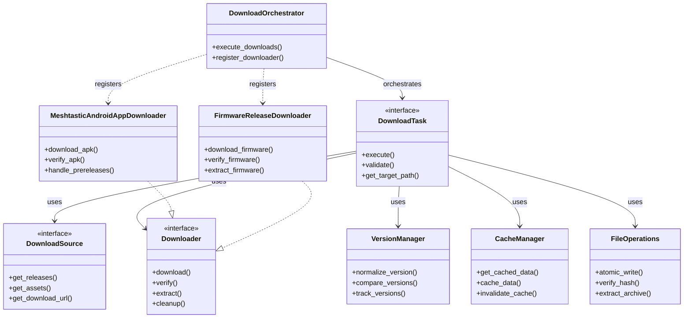

# Fetchtastic Downloader Subsystem Refactoring Plan

## Executive Summary

This document outlines the comprehensive refactoring of Fetchtastic's monolithic downloader subsystem into a modular, extensible architecture that preserves all existing functionality while enabling future expansion.

## Current State Analysis

### Architecture Overview

The current downloader architecture is centered around a single monolithic [`downloader.py`](src/fetchtastic/downloader.py) file (6,475 lines) that handles:

1. **Android APK Downloads**: Meshtastic Android app releases
2. **Firmware Downloads**: Meshtastic firmware releases
3. **Repository Downloads**: Static files from meshtastic.github.io
4. **Version Management**: Complex version parsing, comparison, and tracking
5. **File Operations**: Download, extraction, verification, and cleanup
6. **Caching**: Release metadata and file integrity caching
7. **Error Handling**: Comprehensive error recovery and retry logic

### Key Components

- **Core Functions**: `check_and_download()`, `_process_apk_downloads()`, `_process_firmware_downloads()`
- **Version Handling**: `_normalize_version()`, `compare_versions()`, version tuple optimizations
- **File Operations**: Atomic writes, hash verification, extraction patterns
- **Caching**: JSON-based cache with expiry, commit timestamp tracking
- **Cleanup**: Old version removal, prerelease management
- **Security**: Path validation, symlink protection, path traversal prevention

### Strengths

- **Comprehensive**: Handles all download scenarios in one place
- **Robust**: Extensive error handling and recovery
- **Well-tested**: 3,453 lines of tests covering edge cases
- **Feature-rich**: Supports prereleases, version tracking, pattern matching

### Challenges

- **Monolithic**: Single file with 6,475 lines is difficult to maintain
- **Tight Coupling**: Download logic mixed with version parsing, caching, and file operations
- **Limited Extensibility**: Adding new downloaders requires invasive changes
- **Complexity**: Deeply nested functions with complex control flow
- **Testing**: Large test file makes it hard to isolate specific functionality

## Target Architecture

### Core Principles

1. **Separation of Concerns**: Clear boundaries between components
2. **Interface-driven Design**: Well-defined contracts between modules
3. **Extensibility**: Easy to add new downloaders without modifying core
4. **Maintainability**: Smaller, focused modules with single responsibilities
5. **Backward Compatibility**: Preserve all existing functionality

### Architecture Diagram



### Component Responsibilities

| Component                        | Responsibility                                                      |
| -------------------------------- | ------------------------------------------------------------------- |
| `DownloadOrchestrator`           | Coordinates multiple download tasks, manages overall workflow       |
| `DownloadTask`                   | Interface for individual download operations with lifecycle methods |
| `DownloadSource`                 | Interface for release/asset discovery from various sources          |
| `Downloader`                     | Base interface for artifact-specific download implementations       |
| `MeshtasticAndroidAppDownloader` | Android APK download logic with prerelease handling                 |
| `FirmwareReleaseDownloader`      | Firmware download with extraction and version tracking              |
| `VersionManager`                 | Version parsing, comparison, and tracking logic                     |
| `CacheManager`                   | Caching infrastructure for releases and metadata                    |
| `FileOperations`                 | Atomic file operations, hash verification, extraction               |

## Migration Plan

### Phase 1: Understanding & Inventory (Current Phase)

**Status**: ✅ Completed

- ✅ Analyzed current downloader architecture
- ✅ Documented all code paths and dependencies
- ✅ Identified implicit behaviors and edge cases
- ✅ Created comprehensive refactoring plan

### Phase 2: Architecture Definition

**Status**: 🚧 In Progress

- [ ] Finalize interface definitions and contracts
- [ ] Design orchestration logic and CLI integration
- [ ] Create detailed class diagrams and sequence diagrams
- [ ] Document design decisions and trade-offs

### Phase 3: Incremental Migration

**Status**: ⏳ Pending

1. **Core Infrastructure** (Week 1)
   - Create `DownloadOrchestrator` class
   - Implement `DownloadTask` interface and base class
   - Implement `DownloadSource` interface
   - Implement `VersionManager` with existing version logic
   - Implement `CacheManager` with existing caching logic
   - Implement `FileOperations` with atomic operations

2. **Meshtastic Android App Downloader** (Week 2)
   - Create `MeshtasticAndroidAppDownloader` class
   - Migrate APK download logic from monolithic downloader
   - Implement Android-specific version handling
   - Implement APK prerelease management
   - Update menu system integration (`menu_apk.py`)

3. **Firmware Release Downloader** (Week 3)
   - Create `FirmwareReleaseDownloader` class
   - Migrate firmware download logic
   - Implement firmware extraction patterns
   - Implement firmware version tracking
   - Update menu system integration (`menu_firmware.py`)

4. **Repository Downloader** (Week 4)
   - Create `RepositoryDownloader` class
   - Migrate repository download logic
   - Update menu system integration (`menu_repo.py`)

### Phase 4: Integration & Testing

**Status**: ⏳ Pending

1. **CLI Integration** (Week 5)
   - Update `cli.py` to use new orchestration layer
   - Preserve all existing command-line arguments
   - Ensure backward compatibility

2. **Testing** (Week 6)
   - Create unit tests for each new component
   - Migrate existing tests to new architecture
   - Add integration tests for orchestration
   - Verify all existing functionality preserved
   - Performance testing and optimization

### Phase 5: Legacy Code Removal

**Status**: ⏳ Pending

1. **Verification** (Week 7)
   - Run comprehensive test suite
   - Manual testing of all download scenarios
   - User acceptance testing
   - Performance benchmarking

2. **Cleanup** (Week 8)
   - Remove old `downloader.py` monolithic implementation
   - Update documentation
   - Final code review and cleanup
   - Release preparation

## Detailed Implementation Plan

### Core Abstraction Layer

#### DownloadTask Interface

```python
class DownloadTask(ABC):
    @abstractmethod
    def execute(self) -> DownloadResult:
        """Execute the download task and return results"""

    @abstractmethod
    def validate(self) -> bool:
        """Validate task requirements before execution"""

    @abstractmethod
    def get_target_path(self) -> Path:
        """Get the target path for this download"""

    @abstractmethod
    def cleanup(self) -> None:
        """Clean up any temporary files or resources"""
```

#### DownloadSource Interface

```python
class DownloadSource(ABC):
    @abstractmethod
    def get_releases(self, limit: int = None) -> List[Release]:
        """Get available releases from the source"""

    @abstractmethod
    def get_assets(self, release: Release) -> List[Asset]:
        """Get downloadable assets for a specific release"""

    @abstractmethod
    def get_download_url(self, asset: Asset) -> str:
        """Get download URL for a specific asset"""
```

#### Downloader Interface

```python
class Downloader(ABC):
    @abstractmethod
    def download(self, url: str, target_path: Path) -> bool:
        """Download file from URL to target path"""

    @abstractmethod
    def verify(self, file_path: Path, expected_hash: str = None) -> bool:
        """Verify file integrity"""

    @abstractmethod
    def extract(self, file_path: Path, patterns: List[str]) -> List[Path]:
        """Extract files matching patterns from archive"""

    @abstractmethod
    def cleanup_old_versions(self, keep_limit: int) -> None:
        """Clean up old versions according to retention policy"""
```

### Meshtastic Android App Downloader

```python
class MeshtasticAndroidAppDownloader(Downloader):
    def __init__(self, config: Dict, cache_manager: CacheManager):
        self.config = config
        self.cache_manager = cache_manager
        self.version_manager = VersionManager()
        self.file_operations = FileOperations()

    def download(self, url: str, target_path: Path) -> bool:
        # Android-specific download logic
        # Handle APK prereleases
        # Implement version tracking
        pass

    def verify(self, file_path: Path, expected_hash: str = None) -> bool:
        # APK-specific verification
        pass

    def extract(self, file_path: Path, patterns: List[str]) -> List[Path]:
        # APK extraction (if needed)
        pass

    def cleanup_old_versions(self, keep_limit: int) -> None:
        # Android version cleanup logic
        pass

    def handle_prereleases(self, releases: List[Release]) -> List[Release]:
        # Filter and manage Android prereleases
        pass
```

### Firmware Release Downloader

```python
class FirmwareReleaseDownloader(Downloader):
    def __init__(self, config: Dict, cache_manager: CacheManager):
        self.config = config
        self.cache_manager = cache_manager
        self.version_manager = VersionManager()
        self.file_operations = FileOperations()

    def download(self, url: str, target_path: Path) -> bool:
        # Firmware-specific download logic
        pass

    def verify(self, file_path: Path, expected_hash: str = None) -> bool:
        # Firmware verification
        pass

    def extract(self, file_path: Path, patterns: List[str]) -> List[Path]:
        # Firmware extraction with pattern matching
        pass

    def cleanup_old_versions(self, keep_limit: int) -> None:
        # Firmware version cleanup
        pass
```

### Download Orchestrator

```python
class DownloadOrchestrator:
    def __init__(self):
        self.downloaders = {}
        self.cache_manager = CacheManager()
        self.version_manager = VersionManager()

    def register_downloader(self, name: str, downloader: Downloader):
        """Register a downloader for a specific artifact type"""
        self.downloaders[name] = downloader

    def execute_downloads(self, config: Dict) -> DownloadResults:
        """Execute all registered download tasks"""
        results = DownloadResults()

        for name, downloader in self.downloaders.items():
            if self._should_download(name, config):
                task = self._create_download_task(name, downloader, config)
                result = task.execute()
                results.add_result(name, result)

        return results

    def _create_download_task(self, name: str, downloader: Downloader, config: Dict) -> DownloadTask:
        """Factory method to create appropriate download task"""
        if name == "android_apk":
            return AndroidDownloadTask(downloader, config, self.cache_manager)
        elif name == "firmware":
            return FirmwareDownloadTask(downloader, config, self.cache_manager)
        else:
            return GenericDownloadTask(downloader, config, self.cache_manager)
```

## Testing Strategy

### Test Coverage Requirements

1. **Unit Tests**: Each component tested in isolation
2. **Integration Tests**: Component interactions
3. **End-to-End Tests**: Complete download workflows
4. **Regression Tests**: Ensure no functionality lost
5. **Performance Tests**: Verify no performance degradation

### Test Migration Plan

1. **Preserve Existing Tests**: Keep all current test scenarios
2. **Refactor Test Structure**: Organize by component
3. **Add New Component Tests**: Test new interfaces and classes
4. **Update Test Fixtures**: Adapt to new architecture
5. **Add Integration Tests**: Test orchestration layer

## Risk Assessment

### Technical Risks

| Risk                            | Mitigation Strategy                     |
| ------------------------------- | --------------------------------------- |
| Breaking existing functionality | Comprehensive regression testing        |
| Performance degradation         | Performance profiling and optimization  |
| Complexity increase             | Clear documentation and examples        |
| Integration issues              | Incremental migration with verification |
| Testing gaps                    | Comprehensive test coverage             |

### Project Risks

| Risk               | Mitigation Strategy                      |
| ------------------ | ---------------------------------------- |
| Scope creep        | Clear boundaries and focus on core goals |
| Timeline delays    | Phased approach with clear milestones    |
| Team coordination  | Regular progress reviews and updates     |
| Documentation gaps | Documentation-first approach             |

## Success Criteria

1. **Functional Parity**: All existing functionality preserved
2. **Modularity**: Clear separation of concerns achieved
3. **Extensibility**: New downloaders can be added easily
4. **Maintainability**: Codebase is easier to understand and modify
5. **Test Coverage**: Comprehensive test suite maintained
6. **Performance**: No significant performance degradation
7. **Documentation**: Complete and accurate documentation

## Timeline

| Phase                 | Duration | Key Deliverables                              |
| --------------------- | -------- | --------------------------------------------- |
| Analysis & Planning   | 1 week   | Refactoring plan, architecture design         |
| Core Infrastructure   | 1 week   | Interfaces, base classes, utilities           |
| Android Downloader    | 1 week   | MeshtasticAndroidAppDownloader implementation |
| Firmware Downloader   | 1 week   | FirmwareReleaseDownloader implementation      |
| Repository Downloader | 1 week   | Repository downloader implementation          |
| Integration & Testing | 2 weeks  | CLI integration, comprehensive testing        |
| Legacy Removal        | 1 week   | Code cleanup, final verification              |

## Next Steps

1. **Review and Approval**: Get stakeholder feedback on architecture
2. **Implementation Planning**: Break down into specific coding tasks
3. **Environment Setup**: Ensure development environment ready
4. **Incremental Implementation**: Start with core infrastructure

## Progress Tracking

### Completed Tasks

- [x] **Current State Analysis** - Documented existing downloader architecture
- [x] **Target Architecture Definition** - Finalized interfaces, modules, and orchestration logic
- [x] **Core Abstraction Layer** - Implemented DownloadTask, DownloadSource, Downloader interfaces
- [x] **Meshtastic Android App Downloader** - Implemented specific Android APK downloader
- [x] **Firmware Release Downloader** - Implemented specific firmware downloader
- [x] **Pipeline Orchestration** - Created DownloadOrchestrator for coordinating multiple downloaders
- [x] **Migration Layer** - Created DownloadMigration for backward compatibility
- [x] **CLI Integration** - Created DownloadCLIIntegration for CLI compatibility

### In Progress

- [ ] **Legacy Code Removal** - Remove old downloader after verification
- [ ] **Test Updates** - Update tests for new architecture
- [ ] **Verification** - Ensure all existing functionality is preserved

### Remaining Work

- [ ] **Legacy Code Removal** - Remove old downloader after verification
- [ ] **Test Updates** - Update tests for new architecture
- [ ] **Verification** - Ensure all existing functionality is preserved

## Progress Update (rf-spectre-1)

- Implemented modular Android, firmware, and repository downloaders; orchestrator currently runs Android and firmware paths with include/exclude filtering and extraction.
- Restored key legacy safeguards: path-component sanitization, glob-based exclude handling, legacy pattern matching, safe ZIP extraction (no traversal), and platform-specific download directories for correct cleanup/reporting.
- CLI first-run/download flows now call `DownloadCLIIntegration.main`, matching legacy return shapes and logging; cron setup gracefully skips when `crontab` is absent.
- Configuration compatibility preserved for legacy keys (`SELECTED_FIRMWARE_ASSETS`, `SELECTED_PRERELEASE_ASSETS`, etc.) and selection/exclude prompts.

## Remaining Work / Handoff Notes

- **Repository orchestration**: Wire `RepositoryDownloader` into `DownloadOrchestrator` with selection/exclude semantics and parity with legacy repo-dls handling.
- **Extraction parity**: Align extraction with legacy validation (`_validate_extraction_patterns`, `check_extraction_needed`), hash/sidecar handling, and exclude-aware behavior.
- **Prerelease flow**: Port commit-history/prerelease tracking (JSON cache, directory scanning, expected-version matching) for firmware/APK; add cache expiry and superseded-prerelease cleanup.
- **Version tracking**: Mirror legacy latest/prerelease JSON writes, retention, and cache invalidation; migrate existing tracking files safely.
- **Retry/error metadata**: Capture per-asset URLs and metadata in results for robust retries and CLI reporting (legacy exposed detailed failed_downloads).
- **Cache manager**: Bring forward cache expiry, commit timestamp caching, and rate-limit tracking from legacy downloader/utils.
- **Menu integration**: Ensure menu selections map cleanly to new config keys without duplication; keep backward-compatible key handling.
- **Migration module**: Currently a compatibility wrapper for CLI; plan to retire by routing CLI directly to orchestrator once parity is verified and legacy code removed.
- **Testing**: Migrate high-value legacy tests (prerelease handling, extraction validation, superseded-prerelease cleanup, hash verification, repo downloads) to modular suites.

## Appendix

### Key Files to Modify

- `src/fetchtastic/downloader.py` → Replace with modular architecture
- `src/fetchtastic/cli.py` → Update to use new orchestration
- `src/fetchtastic/menu_apk.py` → Update for new Android downloader
- `src/fetchtastic/menu_firmware.py` → Update for new firmware downloader
- `src/fetchtastic/menu_repo.py` → Update for new repository downloader
- `tests/test_download_core.py` → Refactor tests for new architecture

### New Files to Create

- `src/fetchtastic/download/orchestrator.py` → Download orchestration
- `src/fetchtastic/download/interfaces.py` → Core interfaces
- `src/fetchtastic/download/android.py` → Android downloader
- `src/fetchtastic/download/firmware.py` → Firmware downloader
- `src/fetchtastic/download/repository.py` → Repository downloader
- `src/fetchtastic/download/version.py` → Version management
- `src/fetchtastic/download/cache.py` → Cache management
- `src/fetchtastic/download/files.py` → File operations
